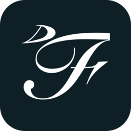

<p align="center"></p>

# Fontelle

A lightweight, Linux-first digital audio workstation built around SoundFont-based
sample playback. An SF2 file supplies *defaults* — loop points, envelopes, filtering,
mapping, tuning — and every one of them is yours to override. Free and open source,
by [Fopull LLC](https://fopull.com).

**Status: early access, and a working studio.** There is a window you can write
a whole piece in; there is still a great deal on the design's list. See
[Project status](#project-status).

## Installing

Grab the archive for your platform from the
[latest release](https://github.com/Fopull-LLC/DAW-Fontelle/releases/latest).

- **Linux** (the platform this is built for): unpack the tarball and run
  `./install.sh`. It puts `fontelle` in `~/.local/bin` with a menu entry and an
  icon — nothing outside your home folder, no root. `./install.sh --uninstall`
  takes it away again. The binary needs ALSA, D-Bus and lilv (for LV2
  plugins) from your distribution — on Debian/Ubuntu
  `sudo apt install liblilv-0-0`, on Fedora and Arch the package is `lilv`;
  the installer says so if anything is missing.
- **Windows / macOS**: unpack and run `fontelle`. The binaries are unsigned for
  now, so expect the first-run warning (macOS: right-click → Open).

Fontelle checks for a newer release when it starts and offers to install it
from its start menu — the download is verified against the release's published
checksums before anything is replaced. The check can be turned off on the
Settings tab.

## Why

Every existing SoundFont player treats the file's internal parameters as authoritative.
Fontelle inverts that: the SF2 supplies a starting point, and nothing about it is locked.
See [`FONTELLE_TDD.md`](FONTELLE_TDD.md) for the full design — product thesis, invariants,
crate layout, milestones, and the open questions still to resolve.

## Running it

```sh
fontelle                          # installed
cargo run --release -p fontelle-app   # from a checkout
```

That opens the **start menu**: your recent projects, *New project*, *Open a
project…*, and whether there is a newer Fontelle. Pick one and you are in the
studio — a channel rack, a soundfont browser, an arrangement, a piano roll and a
mixer, over a real audio device. `--no-menu` skips the menu; `--help` lists the
rest.

Your soundfonts live in a folder Fontelle scans, shown at the bottom of the
browser. **Open folder** shows you that folder in your file manager, creating it
if it is not there yet — drop your `.sf2` files in and they appear.
**Change…** picks a different folder (`Ctrl`+click to add one alongside rather
than replace), and the choice is remembered. The default is
`~/.local/share/fontelle/soundfonts`; there is a command-line equivalent if you
prefer:

```sh
cargo run --release -p fontelle-app -- --soundfonts /path/to/your/soundfonts
```

Then: pick a soundfont in the browser, pick a preset (a plain click puts it on
the selected channel; `Ctrl`+click puts it on a new one), and draw.

| | |
|---|---|
| Draw / delete a note | left mouse / right mouse |
| Draw one to length | drag out from an empty cell |
| Lengthen one | drag its right edge |
| Tools | `P` draw, `B` paint, `E` select, `D` delete |
| Snap | `S` cycles bar / beat / 1&frasl;8 / 1&frasl;16 / 1&frasl;32 / triplet / off |
| Off the grid, one axis | hold `Alt`, hold `Shift` |
| Select a region | the Select tool, or `Ctrl`+drag |
| Clipboard | `Ctrl+C` / `X` / `V`, `Ctrl+B` duplicate |
| Undo / redo / save | `Ctrl+Z` / `Ctrl+Y` / `Ctrl+S` |
| Play | `Space` |
| Scroll | wheel for pitch, `Shift`+wheel for time |
| Zoom, about the pointer | `Ctrl`+wheel for time, `Ctrl+Shift`+wheel for pitch |
| Find a soundfont | `Ctrl+F`, then type — it matches letters in order, so `gus` finds `GeneralUser GS` |
| Every shortcut | `F1`, or the `?` on the start menu and the transport bar — click one there to change it |

The command line is still there and does more than the window does — offline
WAV bounces, MIDI file import, live MIDI in, recording a take. `--play-sf2
<file>` plays a demo phrase through a preset; add `--window` to open the same
project in the editor, `--open <project.fontelle>` to reopen a saved one.

## Project status

Early access. Everything below is built, tested and used; the design in
[`FONTELLE_TDD.md`](FONTELLE_TDD.md) goes further, and
[`PROGRESS.md`](PROGRESS.md) is the blunt, living account of where each part
stands — read it before trusting this list.

**Composing.** An arrangement with lanes and clips (MIDI, audio, automation),
looping, stretch and cut, fades, a blade, and prefabs; a piano roll with draw,
paint, select and delete tools, snap down to 1/32 and triplets, a property
lane, ghosts, an arpeggiator and legato joining; slides and pitch bends;
full undo, autosave and backups; project bundles that reopen with their audio.

**Sound.** The SoundFont sampler with every parameter user-owned and
automatable; **Flopsynth**, the built-in synthesiser, with a 338-preset bank;
a physically-modelled drum machine; sampler channels from imported audio;
live MIDI with hot-plug, MIDI recording, MIDI and FL Studio score import;
audio import, recording with monitoring, an audio clip editor, and offline
rendering to WAV.

**Mixing.** A mixer with sends, routing and a master bus with a brickwall limiter; insert
chains with wet/dry and delay compensation; track presets; twelve built-in
effects, each a family rather than one sound — Utility, EQ, Filter,
Compressor (with sidechain), Gate, Distortion, Bitcrush, Soften, Chorus,
Delay, Reverb and Tune, an autotune.

**Plugins.** CLAP and LV2 instruments and effects, with their own editor
windows and their state in the project.

**Not built.** VST2/VST3 hosting (a bridge is designed, out of tree), plugin
*export*, sample streaming (a soundfont is fully resident), and the later
milestones of the design. Windows and macOS builds come off the same release
workflow as Linux and are less exercised.

See [`docs/scaffolding-notes.md`](docs/scaffolding-notes.md) for the one structural
decision made during scaffolding that isn't explicit in the TDD.

## Building

Requires Rust 2024 edition (MSRV 1.88.0). On Linux you'll also need ALSA, lilv
(LV2), D-Bus (for rtkit) and windowing/XKB development headers:

```sh
sudo apt install libasound2-dev libudev-dev libxkbcommon-dev libwayland-dev \
    libxcb1-dev libxcb-render0-dev libxcb-shape0-dev libxcb-xfixes0-dev \
    liblilv-dev libdbus-1-dev

cargo check --workspace
```

## Releasing

One version number for the whole workspace, in the root `Cargo.toml`. Bump it,
commit, then tag and push:

```sh
git tag v0.2.0 && git push origin v0.2.0
```

[`release.yml`](.github/workflows/release.yml) refuses a tag that does not match
the version in the tree, builds the Linux, Windows and macOS archives, and
publishes them with a `SHA256SUMS` — which is what the start menu's updater
reads.

## License

Dual-licensed under [MIT](LICENSE-MIT) or [Apache-2.0](LICENSE-APACHE), at your option.

The factory Grand Piano's recordings (`assets/flopsynth/samples/grand/`) are
cut from the **Salamander Grand Piano** by Alexander Holm, published under
[CC BY 3.0](http://creativecommons.org/licenses/by/3.0/) and assembled as a
soundfont by the [FreePats project](https://freepats.zenvoid.org/Piano/acoustic-grand-piano.html);
they stay under that licence, with that credit.

The factory kits' recordings (`assets/flopsynth/samples/kit/`) are Fontelle's
own drum machine, cut hit by hit; `assets/flopsynth/samples/kit/README.md` says
how.

"SoundFont" is a Creative/E-mu trademark and is used here only descriptively.
